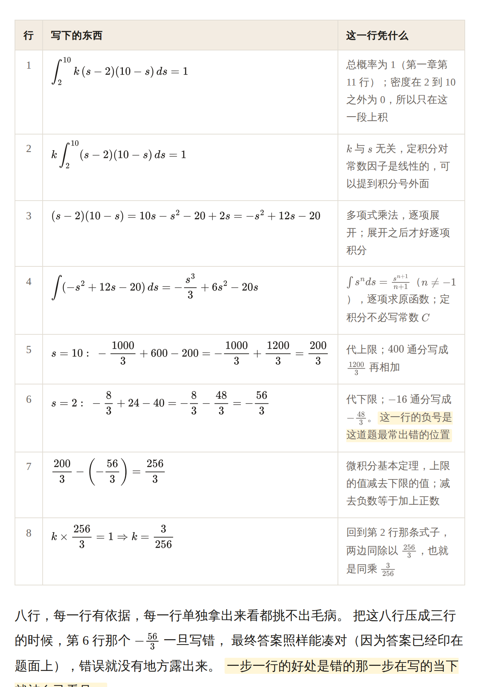
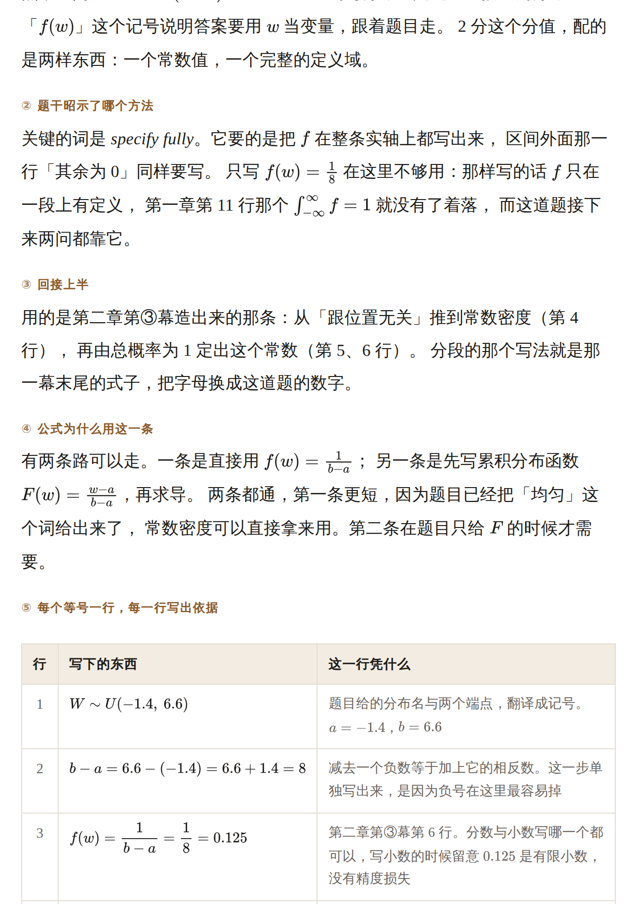
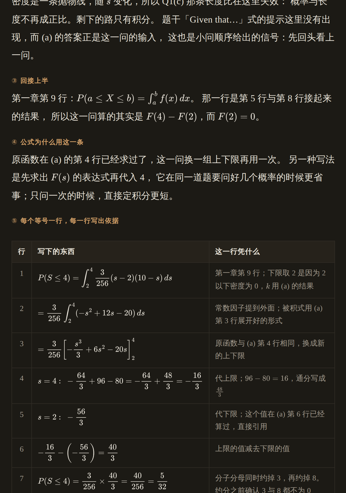
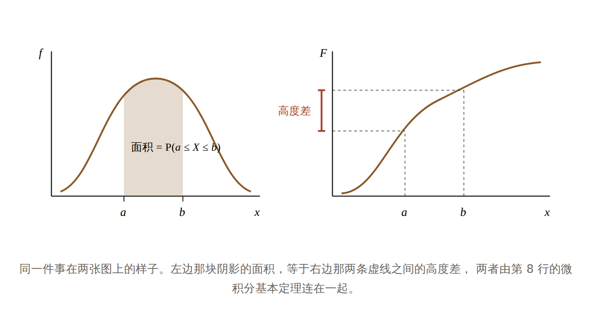
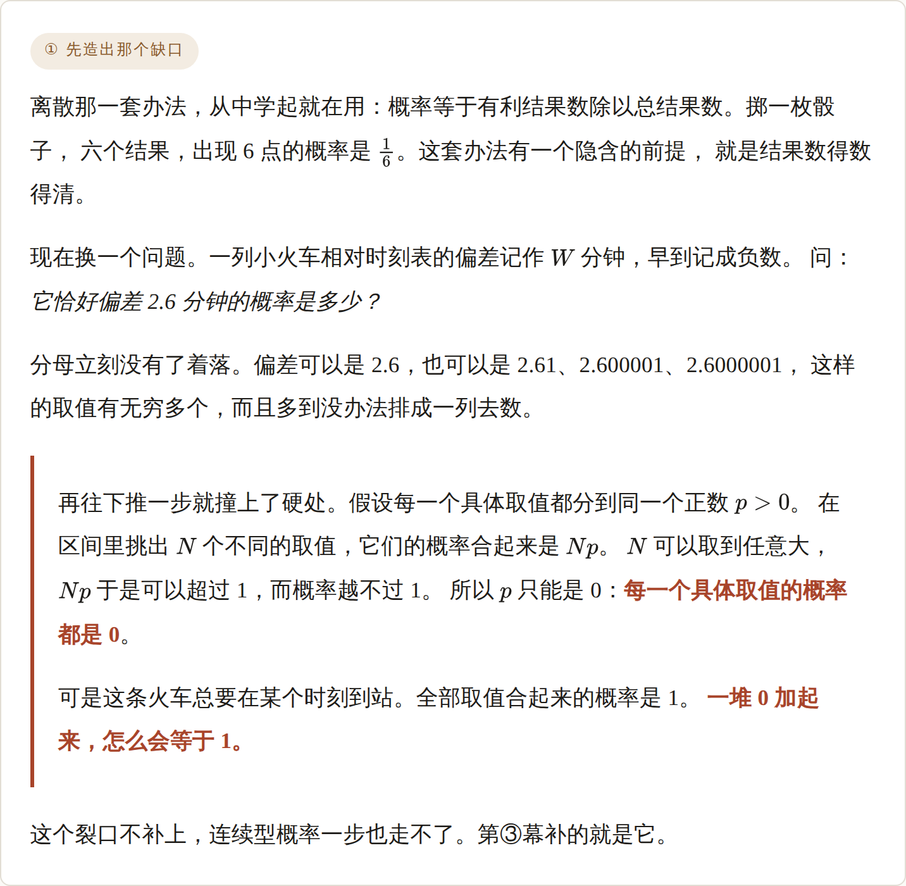
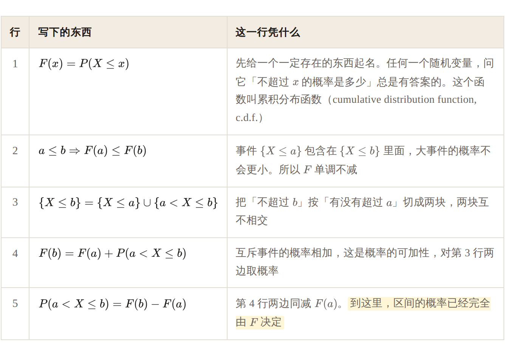

<div align="center">

# 简易对话 · dialogue-tutor

**一个对话式学习教练技能（Claude Agent Skill / Claude Code Plugin）。**

发来一道题、一个概念、或者一段看不懂的内容，它先把这道题背后的公式从本质讲透，
交出一份可以在浏览器里读的 HTML；读完还有疑问，再一来一回把剩下的聊通，
答案由学习者自己说出。

这套结构不限于数学，[换一个领域照样成立](#不只是数学一个非数学场景的实例)。

[](LICENSE)
[](#装法)
[](plugins/dialogue-tutor/skills/dialogue-tutor/SKILL.md)
[](#三科的链拆法不同)

### ▶ [打开演示页：《连续随机变量与均匀分布》](https://jinshanbaihai.github.io/dialogue-tutor/)

<sub>真实产物的样章：上半两章七幕，下半六个小问，320 条公式，一万三千字。</sub>

</div>

[](https://jinshanbaihai.github.io/dialogue-tutor/)

---

## 三种处境，这个技能各自接住一种

**第一种：题会做，讲不出为什么这么做。**
考前把题型和步骤记下来，考场上碰到同一类题还能对付，换一个包装就停住了。
这个技能的初衷用一句话写在 SKILL.md 开头：**完全理解数学**。
所以最要紧的那件工作是从彻底的本质讲解一条公式，把答案算对排在它后面。

**第二种：AI 给回来的是一张关系表。**
`f(x)=F'(x)`、`E(X)=∫xf(x)dx`、「众数解 f′(x)=0」，再加一句「必背」。
读完拿到的是一份索引，考场上照样写错，因为没有一个「为什么」被回答掉。
SKILL.md §1.8 记着这一条的原话：**罗列不是讲解**。
每一段发出之前跑两个检验：小学生检验查的是有没有跳步，苏格拉底检验查的是「怎么做」还是「为什么必然如此」。

**第三种：解答在等号之间跳过去了。**
三个等号挤在一行，中间那两步就消失了。压缩还会把错误一起藏起来：
一份真实产物里 `200/3 − (−88/3) = 256/3` 这一行，下限代错了、算式也不成立，
最终答案却是对的，因为答案早就印在题面上。
所以下半的规格是**每个等号单独占一行，每一行旁边写出这一行凭什么成立**，
纵向查上一行推不推得出下一行，横向查这一行自己立不立得住。

<div align="center">

<br>
<sub>同一问原来是三行。八行摊开之后，第 6 行那个负号一旦写错，当场就看得见。</sub>
</div>

---

## 演示页里可以直接看到的东西

[演示页](https://jinshanbaihai.github.io/dialogue-tutor/)是按这个技能自己的规格生成的样章，
源文件就是本仓库的 `docs/index.html`，下载下来用浏览器打开是同一份。点开能够看到下面这些：

| 在页面上找 | 对应 SKILL.md 的哪一条 |
|---|---|
| 第一章七个带编号的幕 | §1.7 一条公式的七幕，分量写在括号里 |
| 第③幕那两张逐行推导表 | §1.7 第③幕「步步推导」的密度 |
| 密度面积 ↔ cdf 高度差那张图 | §1.10「能画图的地方别偷懒」 |
| Q1(a) 底下 ①②③④⑤⑥ 六个小标 | §1.9 一个小问要写到的六样 |
| Q2(a) 那张八行表 | §1.9 ⑤ 纵向与横向两条检查 |
| 一条裸露的 LaTeX 源码也没有 | §1.10 交付前的三项渲染自检 |

<table>
<tr>
<td width="50%"></td>
<td width="50%"></td>
</tr>
<tr>
<td align="center"><sub>一个小问六样齐全，得分位置排在最后一样</sub></td>
<td align="center"><sub>浅色深色跟随系统</sub></td>
</tr>
</table>

<div align="center">

<br>
<sub>同一件事在两张图上的样子。图里的标注同样走数学排版，不写成 <code>1/(b−a)</code> 这样的斜杠分数。</sub>
</div>

---

## 产物分成两半，哪一半都不压

作者的原话：**前半部分一股脑把涉及到的一切知识点本质和公式本质详细讲解和步步推导清楚，
后半部分是按照题目自己的顺序一个个小问非常耐心地步步讲解清楚。**

```
上半 · 讲解篇    按对象分章，每章七幕
下半 · 做题篇    按题目自己的顺序，一题一节，一个小问一段
```

### 上半：题目降成钩子，讲的是那个数学对象

一份六道题的作业，背后常常只有三四个对象。**按对象立章，不按题号立章**，
因为按题号排的章天然写成答案解析，每一节的边界就是一道题的边界。
当场能跑的测试：把那几道题整个抹掉，剩下的还能不能当这一章的入门讲解读。

每一章七幕，顺序固定，分量写在括号里：

| 幕 | 它负责什么 | 分量 |
|---|---|---|
| ① 造出缺口 | 先给一个用手上工具够不着的具体情形，让旧办法在眼前断掉 | 中 |
| ② 那个人 | 谁、哪一年、卡在什么问题上、手上有什么、缺什么 | 中 |
| ③ 造出来 | 每一步说清楚为什么走这一步，**到最后一刻才给它命名** | **最重** |
| ④ 无关的经典例子 | 跟作业题毫无关系的那个案例，公式因此独立站住 | 重 |
| ⑤ 另一种看法 | 同一件事谁给过别的答案，两边差在哪，各自可检验的后果 | 中 |
| ⑥ 它自己承认的边界 | 什么时候不成立，有名有姓的批评一条 | 中 |
| ⑦ 回到这道题 | 只写一句话：对应下半哪几个小问 | 最短 |

<div align="center">

<br>
<sub>第①幕在演示页里的样子：公式还没有出现，先让旧办法在眼前断掉。</sub>
</div>

<div align="center">

<br>
<sub>第③幕造密度之前的五行：先把区间的概率交给 <code>F</code>。左栏一行一个等号，右栏写出这一行凭什么。</sub>
</div>

字数判据借自作者的简报规范：**读完能不能把这条公式的来龙去脉讲给另一个人听。**
能，就够长了；不能，就还太短，不管它已经有多少字。

另有一条排在动笔之前（§1.75）：先把下半每个小问要用到的公式列成一张单子，
**单子上那几条的推导与追溯，详细程度排在全篇最前面**。

### 下半：一题一节，一个小问一段，一个也不漏

「前面讲解细致、后面用一个章节快速收束题目」这个念头被算作无耐心。
四个小问都在用归一化条件，就写四遍，每一遍连着它自己那道题的题干。
交付前拿原卷点一遍小问编号，速查卡里有、正文里没有，算漏。

每个小问六样齐全，顺序固定：

| # | 这一样写什么 |
|---|---|
| ① 题干拆解 | 一句一句拆开，每句写出它给了什么、限制了什么，括号里的单位与分值也算 |
| ② 题干昭示了哪个方法 | 哪个词指向哪个方法，**并且说清楚别的方法在这里为什么不合适** |
| ③ 回接上半 | 这一步用的是上半哪一章第几幕造出来的东西，指名道姓 |
| ④ 公式的选择 | 为什么用这一条而不是别的；两条路都通的时候两条都摆出来 |
| ⑤ 步步推导 | 每个等号一行，每行写出依据；纵向查推得出推不出，横向查这一行自己立不立得住 |
| ⑥ 得分位置 | mark scheme 认哪一步。这一样放在最后，篇幅最短 |

第⑤样的查法是假想读者拿着笔逐行审：
**任何一行他停下来问「凭什么」或者「这里不对吧」，那一行就算没写够。**

---

## 对话那一侧，规矩相反，求快

产物那边求透，对话这边求快。两者的分界写在 SKILL.md 开头的「两个元件」那一节。

- **回复分回顾、讲、问三段**，一次只问一个问题，除了回顾那几行不用标题与列表。
- **提问只站在已经讲清楚的前提上**。提问里出现的每个概念、记号、公式，
  来源只有两处：这一轮回顾列表里的条目，或者此前确认掌握过的知识。
  两处都不是，这一回合先把它讲清楚再提问。
- **一轮追问滚雪球**。每追问一次，回复开头那张结论清单就长一条；
  答对检验问题，这个点关闭，雪球清空。
- **追问回合零工具调用**。不查 Notion、不画图、不建任务、不联网。
  唯一的例外是「讲清楚原理」模式，那里可视化回归。
- **「显然」「显而易见」「易知」「不难看出」这几个说法不出现。**
  作者的原话：数学没有任何显而易见。
- **答案始终留给学习者说出来**；他明确说「直接告诉我」的时候照办。

追问的条数还是那份 HTML 的成绩单：一次也没追问，这份合格了；
同一个地方追问三次，说明那一处一开始只写了一行。

---

## 装法

```
/plugin marketplace add jinshanbaihai/dialogue-tutor
/plugin install dialogue-tutor@dialogue-tutor
```

装完如果提示 `Run /reload-plugins to activate.`，跑一下 `/reload-plugins`。
技能带命名空间，形如 `dialogue-tutor:dialogue-tutor`，
不过它是**模型自动触发**的（靠 frontmatter 里的 `description`），
命名空间只影响手动 `/` 调用时的写法。

触发词：「这道题怎么做」「讲一下这个」「带我过一遍」「考我」
「我们对话学」「简易对话」「讲清楚原理」「为什么会这样」。

本地试的时候不必先安装：

```bash
claude --plugin-dir ./plugins/dialogue-tutor
claude plugin validate ./plugins/dialogue-tutor --strict
```

### claude.ai 网页版

网页版的技能是账号级的，插件那条路走不通。
把 `plugins/dialogue-tutor/skills/dialogue-tutor/` 整个目录打成 zip
（顶层目录名需要等于 `SKILL.md` 里的 `name`），去
claude.ai/customize/skills →「+」→ Create skill → Upload a skill。
`references/` 里那三份需要一起打进去，缺了会影响讲解质量。

---

## 三科的链拆法不同

| 科目 | 链的拆法 | 考场条件 |
|---|---|---|
| TMUA 数学 | 按推理步骤拆，含「这一步的依据是什么」类节点 | 无计算器、无公式册、选择题 |
| 统计 S2（Edexcel IAL） | 「写出中间式」单独算一个知识点，M1 给在方法行 | 有计算器，给公式册与统计表册 |
| 经济 9708（CIE） | 论述题按得分点拆：定义 → 机制 → 图 → 应用 → 评价 | P3 选择 + P4 数据分析与论述 |

随口问的数学问题也在范围里，题目不必来自这三科。

---

## 不只是数学：一个非数学场景的实例

七幕与六样管的是**「一个被造出来的东西怎么讲透」**，跟它是不是公式无关。
2026-08-15 有一份实例把同一套结构原样用在了一份申请文书的背景阅读上：
28 万字，上半六个对象各走七幕，下半按文书自己的顺序一句一节，共 20 节，
45 张插图、58 张表格，公式照样走 MathJax。

**上半那六个对象**，一个都不是数学对象，七幕却一个字没改：

| 章 | 造出来的那个对象 | 第一幕的缺口 |
|---|---|---|
| 一 | 福利的度量空间（能力进路） | 收入这把尺子在什么地方断掉 |
| 二 | 价格作为一条信息通道（自发秩序） | 坐在中央的那个人需要知道什么 |
| 三 | 支付意愿是被测量的还是被造出来的（锚定） | 需求曲线是怎么画出来的 |
| 四 | 价格歧视的三级与那笔福利账 | 直觉与分析在第一步就分开了 |
| 五 | 一句话离开语境之后怎么读（语境主义） | 同一串字，两个意思 |
| 六 | 道德地位要不要拿理性做门槛 | 判准和它自己的结论对不上 |

「跟本题无关的经典例子」那一幕照样成立：饥荒里的米在哪里、一块锡与一支铅笔、
社保号码那个实验。都跟那份文书毫无关系，正好拿来把对象本身讲透。

**下半的六样按同一个骨架翻译**，只换名词：

| 数学场景（§1.9） | 文书场景 |
|---|---|
| ① 题干拆解 | ① 句子拆解 |
| ② 题干昭示了哪个方法 | ② 这一句在调用哪份文献 |
| ③ 回接上半 | ③ 回接上半（不变） |
| ④ 公式为什么用这条而不是别的 | ④ 为什么是这条文献而不是别的 |
| ⑤ 每个等号一行并写依据 | ⑤ 逐行核查（每一句引述对着原文核一遍） |
| ⑥ 得分位置 | ⑥ 面试会从哪里追问 |

那一份还多出一样，后来反向搬回了数学：给⑤配一套四色判定，
**准确 / 不精确 / 不成立 / 未能核实**，让逐行检查的结果看得见，
而不是埋在一段文字里。

### 判断一个场景适不适用

一句话：**这件事情里有没有一个被人造出来的对象，而且它当初是为了补某个缺口。**
有，七幕就跑得起来——「能力进路」「自发秩序」「锚定效应」「语境主义读法」，
每一个都有提出它的人、当时卡住的问题、被谁批评过。
没有这样的对象（纯操作手册、纯清单），这套结构派不上用场，别硬套。

规格写在 [`SKILL.md` §1.11](plugins/dialogue-tutor/skills/dialogue-tutor/SKILL.md)。
那份文书讲解本身涉及作者的申请材料，没有收进本仓库。

---

## 目录结构

```
.claude-plugin/marketplace.json           ← 市场清单
docs/
├── index.html                            ← 演示页，GitHub Pages 的根
└── images/                               ← README 用的截图
plugins/dialogue-tutor/
├── .claude-plugin/plugin.json            ← 插件清单
└── skills/dialogue-tutor/
    ├── SKILL.md                          ← 技能正文
    └── references/
        ├── 考纲与考试局.md               ← 会话开头读一次：记号、公式册、计算器规则
        ├── 数学的冲突读法.md             ← 七幕里第⑤⑥幕的弹药，六对互相冲突的读法
        └── 统计术语中英对照.md           ← S2 常用术语与 mark scheme 的标准搭配
```

`skills/<name>/` 这层结构有一条要求：目录名需要等于 `SKILL.md` 里的 `name`，
对不上 Claude Code 会加载不了。

---

## 渲染上的三个坑

数学产物在浏览器里翻过车，写在 SKILL.md §1.10。最要紧的是第一条：

- **公式里的 `<` 与 `>` 需要转义。** 裸的小于号会被浏览器当成标签开头，
  吞掉整段正文，被吞的那段带着配对的 `\)`，MathJax 于是不渲染，
  裸 LaTeX 源码留在页面上。一份真实产物里这样的幽灵标签有 71 个。
  写成 `&lt;` `&gt;`，或者在 LaTeX 里改用 `\lt` `\gt`。
- **交付前在浏览器里真的打开一次**，搜一遍页面上有没有裸露的 LaTeX 源码。
  本仓库这份演示页就是这样验的：320 条公式全部排出来，裸源码 0 处。
- **图里的标注同样走数学排版。** SVG 里用 `<tspan>` 配上下标与分式，
  matplotlib 用 mathtext，别把图里的分数写成 `1/(b−a)`。

---

## 它适合谁，以及什么时候它不合用

适合想要从最本质的地方接触一门学问、一次跳步就会被拦住的人。
读者模型是作者给的原话：**渴望从最本质的地方接触一个数学，容易被跳步阻碍而抱憾的人。**
数学是它长出来的地方，[非数学场景同样跑得起来](#不只是数学一个非数学场景的实例)。

下面这几种场合它派不上用场，选别的工具更省事：

- **只想要答案。** 这个技能会先讲一万字再落到答案上。
- **考前一小时抱佛脚。** 七幕与六样都是慢工，时间不够的时候它帮不上忙。
- **要的是标准答案模板。** 得分点照常给，位置在每个小问的最后一样，篇幅是收尾那几句。
  站在阅卷人的位置写，这个技能一开始就搞错了对象。
- **英文教学。** 讲解正文是中文，专有名词中英并列。

---

## 来历

这个技能原本是一个多技能私有仓库里的一个，2026-08-14 拆出来单独公开。
公开这一份做过轻度脱敏：去掉了作者的称呼、本机云盘路径、Notion 页名与应考日期，
教学法、七幕结构、六样齐全、渲染自检那些一字未动。
`references/` 里几处指向作者私有技能的说明，改写成了不带路径的提示。

它的前身是一个按阅读流设计的数学导师技能（可视化主载体、单向讲透、零回复压力），
2026-08-12 被这一版取代。取代的理由写在 SKILL.md §9：
旧技能每条回复背着可视化、Notion 查询、出题规范一整套流程，
于是思考过久，长回复又在讲解上跳步。

SKILL.md §9 记着六个版本各自因为什么改动，每一条都连着一次实跑的反馈。
想知道某一条规格为什么长成这样，那一节读得到。

## 许可证

MIT，见 [`LICENSE`](LICENSE)。演示页里的两道题为演示编写，取材于 Edexcel IAL Statistics S2 常见题型。
