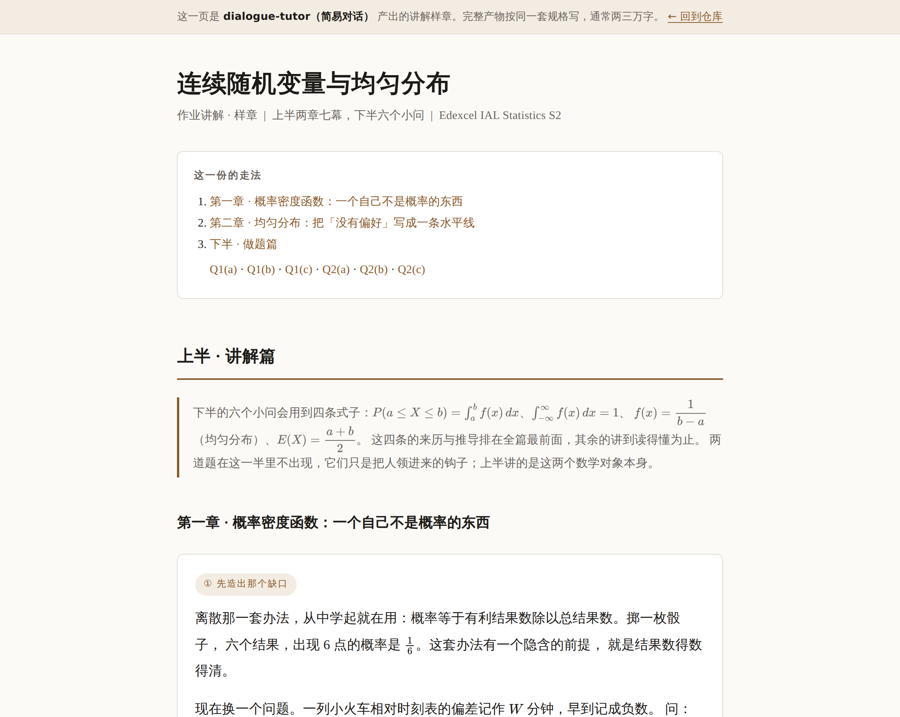
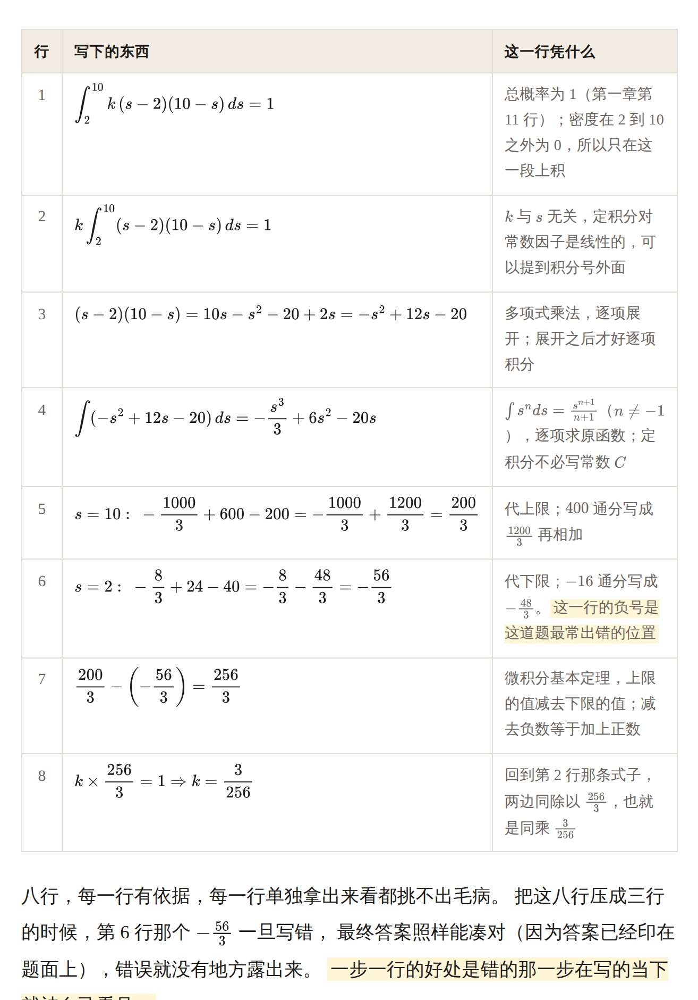
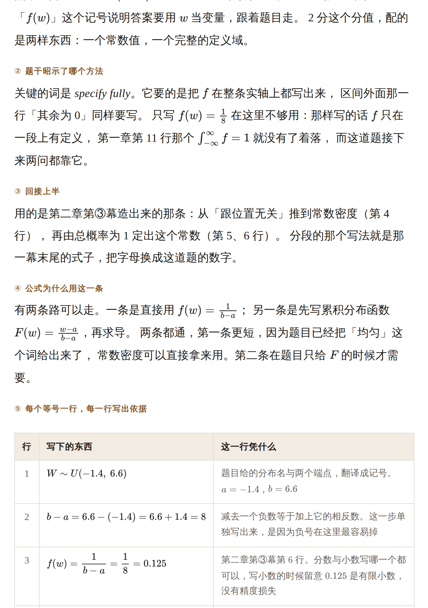
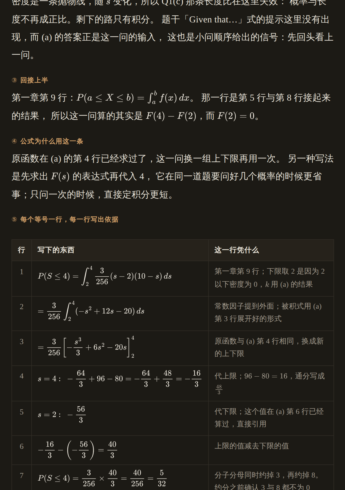
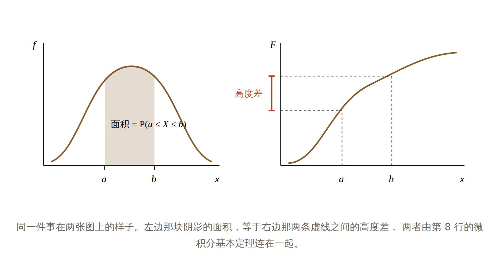
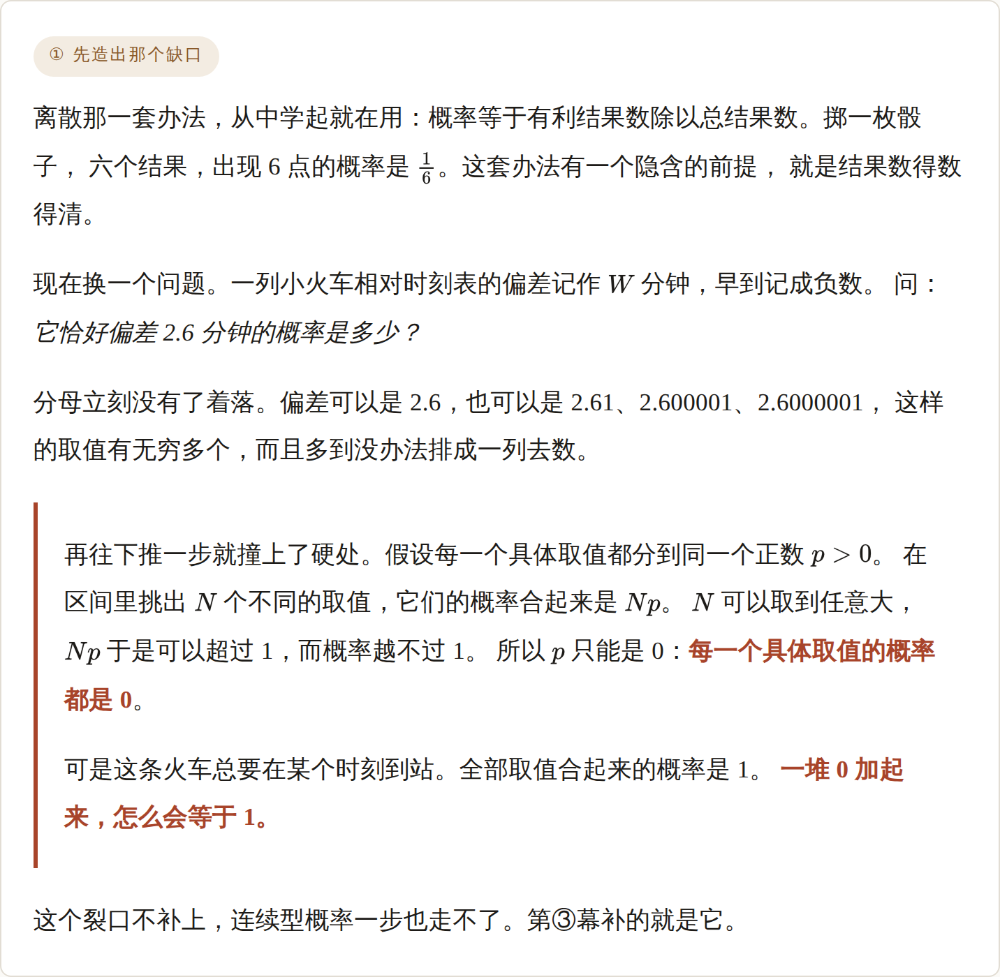
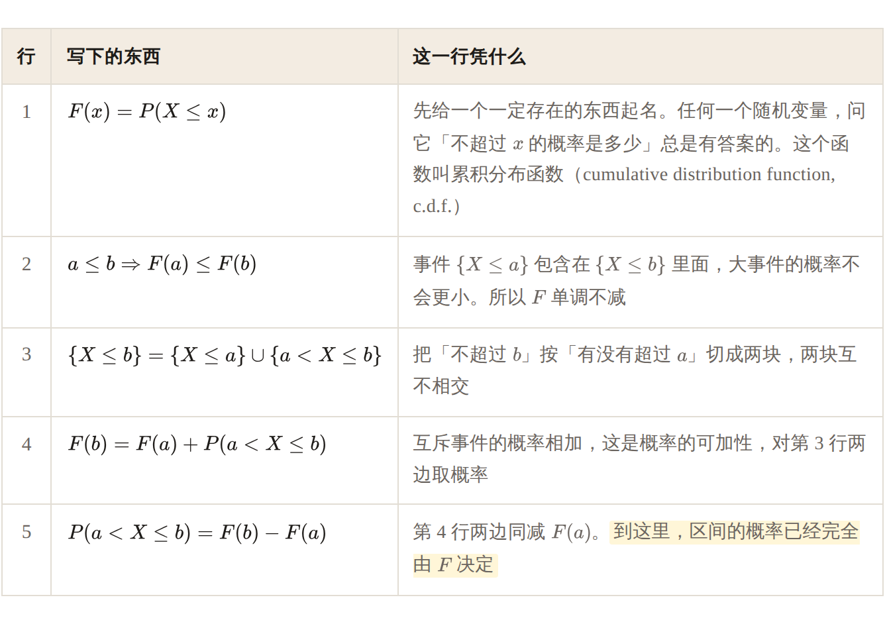

<div align="center">

# 简易对话 · dialogue-tutor

**一个生成交互式学习 HTML 的对话教练技能（Agent Skill / Claude Code Plugin）。**

发来一道题、一个概念、或者一段看不懂的内容，它先把这道题背后的公式从本质讲透，
交出一份可以在浏览器里阅读、作答、翻卡与探索的 HTML；读完还有疑问，再一来一回把剩下的聊通，
答案由学习者自己说出。

这套结构不限于数学，[换一个领域照样成立](#不只是数学一个非数学场景的实例)。

[](LICENSE)
[](#装法)
[](plugins/dialogue-tutor/skills/dialogue-tutor/SKILL.md)
[](#三科的链拆法不同)

### ▶ [打开演示页：《连续随机变量与均匀分布》](https://jinshanbaihai.github.io/dialogue-tutor/)

<sub>1.6.0 交互样章：两章七幕、六个原题小问、15 处学习活动，其中四组翻卡共 12 张。</sub>

</div>

[](https://jinshanbaihai.github.io/dialogue-tutor/)

<sub>本页保留的七张截图展示早期阅读版式，不能作为 1.6.0 新交互的操作证据。当前交互请打开演示页。</sub>

---

## 三种学习处境

**第一种：题会做，讲不出为什么这么做。**
考前把题型和步骤记下来，考场上碰到同一类题还能对付，换一个包装就停住了。
这个技能的初衷用一句话写在 SKILL.md 开头：**完全理解数学**。
所以最要紧的那件工作是从彻底的本质讲解一条公式，把答案算对排在它后面。

**第二种：AI 给回来的是一张关系表。**
`f(x)=F'(x)`、`E(X)=∫xf(x)dx`、「众数解 f′(x)=0」，再加一句「必背」。
读完拿到的是一份索引，考场上照样写错，因为没有一个「为什么」被回答掉。
SKILL.md §1.8 记着这一条的原话：**罗列不是讲解**。
每一段发出之前跑两个检验：小学生检验查的是有没有跳步，苏格拉底检验查的是「怎么做」还是「为什么必然如此」。

**第三种：解答在等号之间跳过去了。**
三个等号挤在一行，中间那两步就消失了。压缩还会把错误一起藏起来：
一份真实产物里 `200/3 − (−88/3) = 256/3` 这一行，下限代错了、算式也不成立，
最终答案却是对的，因为答案早就印在题面上。
所以下半的规格是**每个等号单独占一行，每一行旁边写出这一行凭什么成立**，
纵向查上一行推不推得出下一行，横向查这一行自己立不立得住。

<div align="center">

<br>
<sub>历史版式：同一问从三行展开，负号与对应依据有了明确位置；新版本继续保留逐步解释。</sub>
</div>

---

## 1.6.0：把 DeepTutor 的交互放进讲解正文

[演示页](https://jinshanbaihai.github.io/dialogue-tutor/)保留《连续随机变量与均匀分布》的
两章讲解与六个小问，加入 **15 处学习活动**。所有新增交互的灵感来自
[HKUDS/DeepTutor](https://github.com/HKUDS/DeepTutor)，具体出处、原版行为与本项目的组合方式
记录在 [DeepTutor 来源说明](plugins/dialogue-tutor/skills/dialogue-tutor/references/deeptutor-provenance.md)。

| 活动 | 在样章中的位置与动作 |
|---|---|
| 四组翻卡，共 12 张 | 在密度、CDF、归一化与均匀分布内容附近，尝试回忆后翻面核对，可查看提示并自评 |
| 两处参数探索 | 调整事件区间，联动密度面积与 CDF 差值；改变均匀分布区间，观察高度、期望与区间概率 |
| 两处推导步进 | 逐步观察公式与依据，可以前进、回退和重置 |
| 一处概念短测 | 检查密度高度与概率面积的区别，提交后查看对应反馈 |
| 六道原题作答 | 每个原题小问都有输入入口；选择与数值采用本地核对，开放推导保留本人原答与自评依据 |

完整解答仍然保留，学习者提交或主动揭示后查看。活动旁可保存笔记和书签，查看预备解释，
复制题目、本人回答与解析以继续对话；学习面板提供当前活动、作答记录与到期复习入口。
笔记和学习记录保存在当前浏览器，支持导出与导入。预备解释是提前写好的内容，页面没有伪装的在线 AI 对话框。

这项能力进入了生成流程：模型先编排活动蓝图，再调用本包的 Python 组装脚本，将正文、
活动数据、CSS 和 JavaScript 内联到 HTML。新学科可以使用通用题卡与自定义交互组件，
不会被固定成这个 S2 样章的两种概率滑杆。说明见
[交互 HTML 参考](plugins/dialogue-tutor/skills/dialogue-tutor/references/interactive-html.md)。

### 学习证据怎样记录

- **客观核对、自评与探索分别保存。** 数值或选项正确不等于推导已经正确；开放解释不采用全文字符串相等判分。
- **提示与揭示保留时序。** 提交之前查看答案的尝试带有辅助标记；提交之后查看正常反馈不会倒改本次证据。
- **一次即时答对只代表本次表现。** 翻面、拖动、阅读位置与模拟学生审读不转换成学习者掌握百分比。
- **复习规则公开。** 页面采用 1、3、7、14、30 天的工程间隔；到期且无辅助的成功复习才推进，同次重试不提前推进。
  这些间隔借鉴 DeepTutor Mastery，没有声称拟合个人遗忘曲线。

[学习研究与采用边界](plugins/dialogue-tutor/skills/dialogue-tutor/references/learning-evidence.md)
说明提取、反馈、间隔、分段伴读和旧规则修订的依据。研究支持的条件、个人教学偏好与工程参数分开记录。

### 保留的阅读版式

<table>
<tr>
<td width="50%"></td>
<td width="50%"></td>
</tr>
<tr>
<td align="center"><sub>历史版式：一个小问六样齐全，得分位置排在最后一样</sub></td>
<td align="center"><sub>历史版式：浅色深色跟随系统</sub></td>
</tr>
</table>

<div align="center">

<br>
<sub>历史版式：同一件事在两张静态图上的样子。1.6.0 另提供区间参数探索，图形、概率与 CDF 差值随操作改变。</sub>
</div>

---

## 产物分成两半，哪一半都不压

作者的原话：**前半部分一股脑把涉及到的一切知识点本质和公式本质详细讲解和步步推导清楚，
后半部分是按照题目自己的顺序一个个小问非常耐心地步步讲解清楚。**

```
上半 · 讲解篇    按对象分章，每章七幕
下半 · 做题篇    按题目自己的顺序，一题一节，一个小问一段
```

### 上半：题目降成钩子，讲的是那个数学对象

一份六道题的作业，背后常常只有三四个对象。**按对象立章，不按题号立章**，
因为按题号排的章天然写成答案解析，每一节的边界就是一道题的边界。
当场能跑的测试：把那几道题整个抹掉，剩下的还能不能当这一章的入门讲解读。

每一章七幕，顺序固定。**主体落在第③幕与第④幕上**：第③幕把这个对象造出来，
第④幕用一道例题把它讲透。

| 幕 | 它负责什么 | 分量 |
|---|---|---|
| ① 造出缺口 | 先给一个用手上工具够不着的具体情形，让旧办法在眼前断掉 | 中 |
| ② 它从哪里来 | 谁、哪一年、卡在什么问题上。两三句带过 | 短 |
| ③ 造出来 | 每一步说清楚为什么走这一步，**到最后一刻才给它命名** | 重 |
| ④ 一道自己写的例题 | 题干清晰、风格照后面那份作业、跟作业没有关系，讲解照下半那六样走 | **最重** |
| ⑤ 另一种看法 | 同一件事谁给过别的答案，两边差在哪。一两句 | 短 |
| ⑥ 它自己承认的边界 | 什么时候不成立、用错会得到什么；有名有姓的批评一句带过 | 中偏短 |
| ⑦ 回到这道题 | 只写一句话：对应下半哪几个小问 | 最短 |

<div align="center">

<br>
<sub>历史版式中的第①幕：公式尚未出现，先说明旧办法遇到的缺口。</sub>
</div>

<div align="center">

<br>
<sub>历史版式中的第③幕：先把区间的概率交给 <code>F</code>，每步附上对应依据。</sub>
</div>

字数判据借自作者的简报规范：**读完能不能把这条公式的来龙去脉讲给另一个人听。**
能，就够长了；不能，就还太短，不管它已经有多少字。

另有一条排在动笔之前（§1.75）：先把下半每个小问要用到的公式列成一张单子，
**单子上那几条的推导与追溯，详细程度排在全篇最前面**。

#### 第④幕：讲解走例题的形式

作者 2026-08-22 的原话：**核心在于上半部分的讲解，必须使用例题的形式，
而这个知识点的来源和批评则只需要简单带过就行了。**
所以这一幕从「一个跟本题无关的经典例子」换成一道自己写的例题，
六条要求跟着它走：

| 例题要满足的 | 具体是什么 |
|---|---|
| 题干非常清晰 | 一句情境、给定的量连着单位、取值范围、问什么、分值、小问编号。只看这个框就能动手算 |
| 风格照后面那份作业 | 同一个考试局的措辞、问法、难度与分值写法。TMUA 就是选择题、不按计算器、公式不给 |
| 跟那份作业没有关系 | 换一个情境、一组数据、一个问法。改几个数字就能互相变过去的，重写一道 |
| 只服务刚讲的那个知识点 | 别的东西都要是他手上已经有的。一道题同时用上两个新对象，他分不清哪一步归这一章 |
| 讲解详细程度跟下半对标 | 照下半那六样走，一样不少。下半怎么讲一个小问，这里就怎么讲一个小问 |
| 动笔前去查这一科的真题 | 认出作业是 TMUA 就去查 TMUA 真题。取真题当例题的，年份卷号题号写出来，拿不准写「未能核实」 |

例题占的是上半原来给经典案例、来历与批评的那部分篇幅，
**下半的详细程度不因为它而降低**：把上半整个抹掉，下半仍旧是一题一节、
一个小问一段、六样齐全；下半每个小问的篇幅跟例题在同一个量级上。
知识点本身照旧讲透，第③幕的逐行推导一步不减。

### 下半：一题一节，一个小问一段，一个也不漏

「前面讲解细致、后面用一个章节快速收束题目」这个念头被算作无耐心。
四个小问都在用归一化条件，就写四遍，每一遍连着它自己那道题的题干。
交付前拿原卷点一遍小问编号，速查卡里有、正文里没有，算漏。

每个小问六样齐全，顺序固定：

| # | 这一样写什么 |
|---|---|
| ① 题干拆解 | 一句一句拆开，每句写出它给了什么、限制了什么，括号里的单位与分值也算 |
| ② 题干昭示了哪个方法 | 哪个词指向哪个方法，**并且说清楚别的方法在这里为什么不合适** |
| ③ 回接上半 | 这一步用的是上半哪一章第几幕造出来的东西，指名道姓 |
| ④ 公式的选择 | 为什么用这一条而不是别的；两条路都通的时候两条都摆出来 |
| ⑤ 步步推导 | 每个等号一行，每行写出依据；纵向查推得出推不出，横向查这一行自己立不立得住 |
| ⑥ 得分位置 | mark scheme 认哪一步。这一样放在最后，篇幅最短 |

第⑤样的查法是假想读者拿着笔逐行审：
**任何一行他停下来问「凭什么」或者「这里不对吧」，那一行就算没写够。**

---

## 三种分类指令：bgct / bbct / olct

同一套规格底下有三种产物类型。发细则的时候把指令写在前面，三个里挑一个，
后面还可以再跟一个 `plustts`。**上面那一整套两半的写法记作 `bgct`**，
另外两类拿它当底子改，改的都是上半。
完整规则在 [SKILL.md §1.65](plugins/dialogue-tutor/skills/dialogue-tutor/SKILL.md)。

| 指令 | 寓意 | 上半 · 讲解篇 | 下半 · 做题篇 | 另外要交的 |
|---|---|---|---|---|
| **`bgct`** | background content | 按对象分章，每章七幕齐全，第④幕是一道自己写的例题；一并上传板书的时候，板书当指导材料融进去 | 全额写 | — |
| **`bbct`** | blackboard content | 整个换成对板书内容的讲解；先把板书长图切开、按顺序读、转写，范围守着考纲；例题那一幕照样写；板书盖不住作业的那一份，拿考纲当板书 | 全额写，规格不动 | — |
| **`olct`**（也写作 `onct`） | ONLY content | 不写。只留一个前置块，装这次做题用得上的公式与定义，考纲外的知识点一个也不用 | 全额写 | — |
| **`… plustts`** | 跟在上面三个后面的后缀 | 照它前面那个指令 | 照它前面那个指令 | 首次作答伴读、参考答案伴读与完整分段 JSON |

下半那六样在哪一类里都齐全，一题一节，一个小问一段，一个也不漏。

**`plustts` 提供与页面对应的完整伴读。** 学习者一边阅读一边用 TTS 收听，
讲解顺序、推导依据与覆盖范围继续保持。为避免普通 TTS 自动念出尚未作答的答案，
课程数据把讲解、活动提示、参考反馈分开，组装器生成三份文件：

- `lesson-listening.txt`：首次作答伴读，包含讲解、题目与明确的暂停提示。
- `lesson-answers.txt`：参考答案伴读，按活动编号保留完整解法、翻卡背面与自评依据。
- `lesson-tts.json`：全部文字片段及其与活动的对应关系。

文件名随 HTML 主文件名变化。两个文字轨道合起来覆盖完整内容；学习者在题目处手动暂停，
作答或主动揭示后再播放参考轨。纯文本不附带自动暂停或页面语音同步。
每个内容块开头仍用一句定位提示引导阅读；无需持续查看屏幕的内容可以安排闭眼收听。

**`bbct` 还有一条：板书盖不住作业的时候，拿考纲当板书。**
板书跟作业常常对不齐，盖不住的那几道题背后照样有知识点，做题的时候一样会卡住。
办法是给它补一块板书：从作业本身判断这是哪一科哪一个单元，去查考纲，
把考纲条目当板书用，条目对应的真题就是这一段讲解的核心参考。
只发了作业、指令却写着 `bbct` 的，整份都走这一步：这时候考纲就是板书。
分界线一句话：**板书盖到的地方板书说了算，板书没盖到的地方考纲说了算，两处合起来把作业盖满。**

---

## 交付前的逐行审读

写完不等于交得出去。规格在 [SKILL.md §1.85](plugins/dialogue-tutor/skills/dialogue-tutor/SKILL.md)，
制作流程依次进行：

1. **先把完整的第一版写完**，两半都写足，七幕六样齐全。
2. **进行文风与内容自检**，环境提供 `writing-style` 与 `respectful-wording` 时读取对应要求。
3. **把可审阅产物交给独立子代理。** 环境没有独立派发入口时，进行分轮作者自检并如实记录。

模拟审读者只使用正文已经建立的前提，检查概念解释、程序计算、前置运算与提示入口。
这项安排用于寻找讲解缺口，不是智力测量，也不代表真实学生的心理状态。
1.6.0 修正了旧版对焦虑与求助研究的过度推论：真实学习者可以提示、跳过、返回或主动查看参考，
跳过不记成错误，也不要求先表达困惑才能继续。

追问要有**学术对话感**：学生列出自己已经跟着走到第几步，指出卡在哪两步之间；
老师从本质入手，**以 8 为始、以 9 为终，中间推演出 8.1、8.2，最后落到 9**。
补出来的小步跟主推导是同一套规格，每个等号单独占一行，每一行旁边写出它凭什么成立，
在纸面上看不出哪一行是后来补的。每个新公式都检查前提和推导；
有具体断点才围绕断点修订与复审，没有缺口时记录通过依据。
提前整理的追问与解答放在对应内容旁，标为“预备解释”，与学习者本人作答分别保存。

## 外部技能与自包含生成

[SKILL.md §1.86](plugins/dialogue-tutor/skills/dialogue-tutor/SKILL.md) 保留外部技能的调用位置。
公开包不包含作者的私有依赖；环境提供对应技能时读取并调用，缺席时采用本技能已写明的检查
与内置 HTML 组件继续生成。记录只描述实际发生的调用。

| 技能 | 在哪一步进来 | 收回来什么 |
|---|---|---|
| `writing-style` 与 `respectful-wording` | 第一版写完之后，独立审读之前 | 文风改动清单；伴读检查短句、清楚指代、可朗读数字与学科内容 |
| `obra-superpowers` | 自查过关之后的自辩论，以及全文完成之后的整体评审 | 每一轮的追问、逐条裁定、一份台账。它的实现者 / 简报 / 评审者 / 发现 / 修复轮 / 定向复审逐个翻译到讲解稿上 |
| `emilkowalski-skills` | 产物是 HTML 的时候，做版面那一步 | 一张 Before / After / Why 三列表。`prefers-reduced-motion` 在这一档产物上是硬约束 |
| `manim` | 选择预渲染连续动画时 | 动画与对应旁白；参数探索和离散推导使用内联组件 |

载体按照学习动作选择：需要自行调整参数时采用探索组件，需要逐项检查推导时采用步进，
需要连续播放的过程可以生成 manim 动画，固定形状使用 SVG 或数学排版。
自包含 HTML 的主要活动不依赖 DeepTutor 后端或模型 API。

---

## 对话那一侧，规矩相反，求快

产物那边求透，对话这边求快。两者的分界写在 SKILL.md 开头的「两个元件」那一节。

- **回复分回顾、讲、问三段**，一次只问一个问题，除了回顾那几行不用标题与列表。
- **提问只站在已经讲清楚的前提上**。提问里出现的每个概念、记号、公式，
  来源只有两处：这一轮回顾列表里的条目，或者此前确认掌握过的知识。
  两处都不是，这一回合先把它讲清楚再提问。
- **一轮追问滚雪球**。每追问一次，回复开头那张结论清单就长一条；
  本次检验通过后结束当前回合，雪球清空；即时通过与长期保持分别记录。
- **追问回合零工具调用**。不查 Notion、不画图、不建任务、不联网。
  唯一的例外是「讲清楚原理」模式，那里可视化回归。
- **「显然」「显而易见」「易知」「不难看出」这几个说法不出现。**
  作者的原话：数学没有任何显而易见。
- **答案始终留给学习者说出来**；他明确说「直接告诉我」的时候照办。

追问提供讲解缺口或延伸兴趣的线索。没有追问本身不足以判断理解，
学习记录另看独立作答、自评、提示使用与延迟复习表现。

---

## 装法

### Claude Code 插件

```
/plugin marketplace add jinshanbaihai/dialogue-tutor
/plugin install dialogue-tutor@dialogue-tutor
```

装完如果提示 `Run /reload-plugins to activate.`，跑一下 `/reload-plugins`。
技能带命名空间，形如 `dialogue-tutor:dialogue-tutor`，
不过它是**模型自动触发**的（靠 frontmatter 里的 `description`），
命名空间只影响手动 `/` 调用时的写法。

触发词：「这道题怎么做」「讲一下这个」「带我过一遍」「考我」
「我们对话学」「简易对话」「讲清楚原理」「为什么会这样」。

本地试的时候不必先安装：

```bash
claude --plugin-dir ./plugins/dialogue-tutor
claude plugin validate ./plugins/dialogue-tutor --strict
```

### claude.ai 网页版

将完整技能 ZIP 上传到账号的技能导入入口。包的顶层目录为 `dialogue-tutor/`，
对应 `SKILL.md` 里的 `name`。1.6.0 同时依赖包内的 `references/`、`scripts/`、`assets/`、
`examples/` 和 `agents/`，只上传 `SKILL.md` 会缺少实际生成组件。

### ChatGPT 与其他支持技能导入的工作环境

导入完整目录 `plugins/dialogue-tutor/skills/dialogue-tutor/`，或使用
[dialogue-tutor-1.6.0.zip](dist/dialogue-tutor-1.6.0.zip)。ZIP 保留与源码相同的目录结构，
包含活动运行组件与 Python 组装器。支持读取技能并运行脚本的环境可以按技能入口生成 HTML。
具体导入方式取决于宿主提供的技能入口；下载或上传文件本身不代表技能已经在账号中安装。

需要自行打包时，在仓库根目录执行：

```bash
python3 scripts/package_skill.py
```

脚本生成 `dist/dialogue-tutor-1.6.0.zip`，并输出文件数量与 SHA-256。

### 构建与验证

在仓库根目录重新生成同一份 S2 演示页：

```bash
python3 scripts/build_demo.py
```

源内容来自 `examples/s2-source.html` 与 `examples/s2-interactive.json`。
制作其他课程时，按 [活动 schema](plugins/dialogue-tutor/skills/dialogue-tutor/references/interactive-html.md)
编排课程 JSON，然后调用通用组装器：

```bash
python3 plugins/dialogue-tutor/skills/dialogue-tutor/scripts/build_lesson.py --lesson lesson.json --output lesson.html
```

保留已有正文时附加 `--base-html existing.html`。生成器使用 Python 标准库，学习者打开生成 HTML
即可使用内联活动，不需要安装 Node.js。以下 Node.js 依赖只用于开发验证：

```bash
python3 -m unittest discover -s tests -p 'test_*.py'
npm ci
npm test
```

检查涉及生成约束、题卡行为、状态记录、复习与恢复。自动检查之后还需在浏览器实际操作生成结果，
检验数学排版、窄屏、键盘和页面上的具体反馈；测试通过不等同于已经证明个人学习收益。

---

## 三科的链拆法不同

| 科目 | 链的拆法 | 考场条件 |
|---|---|---|
| TMUA 数学 | 按推理步骤拆，含「这一步的依据是什么」类节点 | 无计算器、无公式册、选择题 |
| 统计 S2（Edexcel IAL） | 「写出中间式」单独算一个知识点，M1 给在方法行 | 有计算器，给公式册与统计表册 |
| 经济 9708（CIE） | 论述题按得分点拆：定义 → 机制 → 图 → 应用 → 评价 | P3 选择 + P4 数据分析与论述 |

随口问的数学问题也在范围里，题目不必来自这三科。

---

## 不只是数学：一个非数学场景的实例

七幕与六样管的是**「一个被造出来的东西怎么讲透」**，跟它是不是公式无关。
2026-08-15 有一份实例把同一套结构原样用在了一份申请文书的背景阅读上：
28 万字，上半六个对象各走七幕，下半按文书自己的顺序一句一节，共 20 节，
45 张插图、58 张表格，公式照样走 MathJax。

> **个性化教科书，文书想用什么，这个教科书就指哪打哪，语言通俗。且提示词完全没改。**
> <sub>——作者对这份实例的概括</sub>

最后那半句是这一节的分量所在：**技能原样跑，没有为这个领域添一句提示词。**
换领域的时候要动的是内容，不是规格。

「个性化教科书」这半句同样有实义：上半那六章不是一份通用大纲，
是照着那份文书要用到的东西裁出来的。文书里调用了能力进路，第一章就造福利的
度量空间；调用了自发秩序，第二章就造价格通道。**章目由下半决定**，
这跟 SKILL.md §1.75「下半会用到的那些公式，追溯得最深」是同一条规矩，
只是在这里决定的是整章的去留。

**上半那六个对象**，一个都不是数学对象，七幕却一个字没改：

| 章 | 造出来的那个对象 | 第一幕的缺口 |
|---|---|---|
| 一 | 福利的度量空间（能力进路） | 收入这把尺子在什么地方断掉 |
| 二 | 价格作为一条信息通道（自发秩序） | 坐在中央的那个人需要知道什么 |
| 三 | 支付意愿是被测量的还是被造出来的（锚定） | 需求曲线是怎么画出来的 |
| 四 | 价格歧视的三级与那笔福利账 | 直觉与分析在第一步就分开了 |
| 五 | 一句话离开语境之后怎么读（语境主义） | 同一串字，两个意思 |
| 六 | 道德地位要不要拿理性做门槛 | 判准和它自己的结论对不上 |

第④幕在那一份里走的是经典案例那一版：饥荒里的米在哪里、一块锡与一支铅笔、
社保号码那个实验。都跟那份文书毫无关系，正好拿来把对象本身讲透。
**例题那一条主要服务数学与统计**；换到手边没有现成题目的领域，
第④幕退回经典案例，或者拿一段跟本篇无关的样例照下半的规格拆一遍。

**下半的六样按同一个骨架翻译**，只换名词：

| 数学场景（§1.9） | 文书场景 |
|---|---|
| ① 题干拆解 | ① 句子拆解 |
| ② 题干昭示了哪个方法 | ② 这一句在调用哪份文献 |
| ③ 回接上半 | ③ 回接上半（不变） |
| ④ 公式为什么用这条而不是别的 | ④ 为什么是这条文献而不是别的 |
| ⑤ 每个等号一行并写依据 | ⑤ 逐行核查（每一句引述对着原文核一遍） |
| ⑥ 得分位置 | ⑥ 面试会从哪里追问 |

那一份还多出一样，后来反向搬回了数学：给⑤配一套四色判定，
**准确 / 不精确 / 不成立 / 未能核实**，让逐行检查的结果看得见，
而不是埋在一段文字里。

### 判断一个场景适不适用

一句话：**这件事情里有没有一个被人造出来的对象，而且它当初是为了补某个缺口。**
有，七幕就跑得起来——「能力进路」「自发秩序」「锚定效应」「语境主义读法」，
每一个都有提出它的人、当时卡住的问题、被谁批评过。
没有这样的对象（纯操作手册、纯清单），这套结构派不上用场，别硬套。

规格写在 [`SKILL.md` §1.11](plugins/dialogue-tutor/skills/dialogue-tutor/SKILL.md)。
那份文书讲解本身涉及作者的申请材料，没有收进本仓库。

---

## 目录结构

```
.claude-plugin/marketplace.json           ← 市场清单
dist/dialogue-tutor-1.6.0.zip              ← 完整技能导入包
scripts/
├── build_demo.py                         ← 从正文与活动数据重新生成演示页
└── package_skill.py                      ← 生成可复现 ZIP
tests/
├── test_builder.py                       ← 组装器检查
├── runtime.test.cjs                      ← 活动与学习状态检查
└── lesson-dom.test.cjs                   ← 生成样章的真实DOM事件检查
docs/
├── index.html                            ← 演示页，GitHub Pages 的根
├── engineering/                         ← 契约与工程记录
└── images/                               ← 保留的历史版式截图
plugins/dialogue-tutor/
├── .claude-plugin/plugin.json            ← 插件清单
└── skills/dialogue-tutor/
    ├── SKILL.md                          ← 技能正文
    ├── agents/openai.yaml                ← 技能界面元数据
    ├── scripts/build_lesson.py           ← 通用课程 HTML 组装器
    ├── assets/interactive/
    │   ├── lesson-runtime.js             ← 活动、反馈与学习记录
    │   └── lesson-runtime.css            ← 可复用界面样式
    ├── examples/
    │   ├── s2-source.html                ← S2 原讲解正文
    │   └── s2-interactive.json           ← 15 处活动与目标
    └── references/
        ├── interactive-html.md          ← 活动编排、schema、生成与 TTS
        ├── deeptutor-provenance.md       ← DeepTutor 的逐项设计来源
        ├── learning-evidence.md          ← 研究依据与采用边界
        ├── 考纲与考试局.md               ← 会话开头读一次：记号、公式册、计算器规则
        ├── 数学的冲突读法.md             ← 七幕里第⑤⑥幕的弹药，六对互相冲突的读法
        └── 统计术语中英对照.md           ← S2 常用术语与 mark scheme 的标准搭配
```

`skills/<name>/` 这层结构有一条要求：目录名需要等于 `SKILL.md` 里的 `name`，
对不上 Claude Code 会加载不了。

---

## 渲染上的三个坑

数学产物在浏览器里翻过车，写在 SKILL.md §1.10。最要紧的是第一条：

- **公式里的 `<` 与 `>` 需要转义。** 裸的小于号会被浏览器当成标签开头，
  吞掉整段正文，被吞的那段带着配对的 `\)`，MathJax 于是不渲染，
  裸 LaTeX 源码留在页面上。一份真实产物里这样的幽灵标签有 71 个。
  写成 `&lt;` `&gt;`，或者在 LaTeX 里改用 `\lt` `\gt`。
- **交付前在浏览器里真的打开一次**，搜一遍页面上有没有裸露的 LaTeX 源码。
  新生成页面使用原生 MathML 时不需要加载数学 CDN；沿用 MathJax 的正文仍需检查实际排版结果。
- **图里的标注同样走数学排版。** SVG 里用 `<tspan>` 配上下标与分式，
  matplotlib 用 mathtext，别把图里的分数写成 `1/(b−a)`。

---

## 它适合谁，以及什么时候它不合用

适合想要从最本质的地方接触一门学问、一次跳步就会被拦住的人。
读者模型是作者给的原话：**渴望从最本质的地方接触一个数学，容易被跳步阻碍而抱憾的人。**
数学是它长出来的地方，[非数学场景同样跑得起来](#不只是数学一个非数学场景的实例)。

下面这几种场合它派不上用场，选别的工具更省事：

- **只想要答案。** 完整 HTML 的重点是解释过程；对话中可以明确要求直接给出答案。
- **只需要很短的概览。** 完整 `bgct` 保留七幕与细致推导；需要限定到作业本身时，可使用 `olct/onct`。
- **要的是标准答案模板。** 得分点照常给，位置在每个小问的最后一样，篇幅是收尾那几句。
  站在阅卷人的位置写，这个技能一开始就搞错了对象。
- **英文教学。** 讲解正文是中文，专有名词中英并列。

---

## 来历

这个技能原本是一个多技能私有仓库里的一个，2026-08-14 拆出来单独公开。
公开初版做过轻度脱敏：去掉了作者的称呼、本机云盘路径、Notion 页名与应考日期，
当时保留原有教学法、七幕结构、六样齐全与渲染自检。
`references/` 里几处指向作者私有技能的说明，改写成了不带路径的提示。

它的前身是一个按阅读流设计的数学导师技能（可视化主载体、单向讲透、零回复压力），
2026-08-12 被这一版取代。取代的理由写在 SKILL.md §9：
旧技能每条回复背着可视化、Notion 查询、出题规范一整套流程，
于是思考过久，长回复又在讲解上跳步。

1.6.0 在原有正文结构上加入源自 DeepTutor 的活动编排和可复用 HTML 组件，
并修订记忆提取、即时通过、学习状态、伴读揭示顺序与研究引用的冲突。
SKILL.md §9 保留历次使用反馈，现行交互入口在 §0.5，完整数据契约在 `references/interactive-html.md`。
想知道某一条规格为什么长成这样，那一节读得到。

## 许可证

MIT，见 [`LICENSE`](LICENSE)。演示页里的两道题为演示编写，取材于 Edexcel IAL Statistics S2 常见题型。
